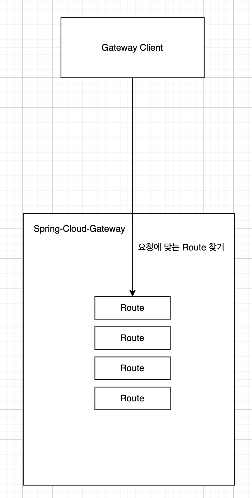
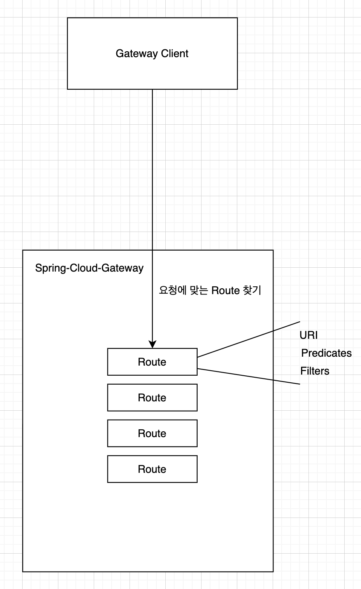
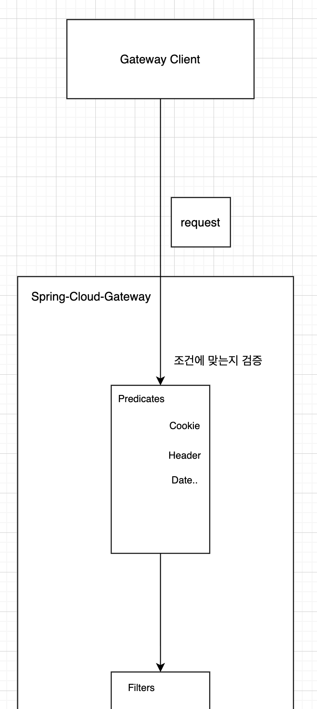
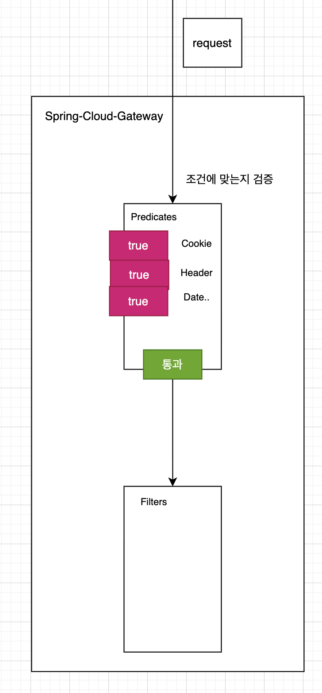
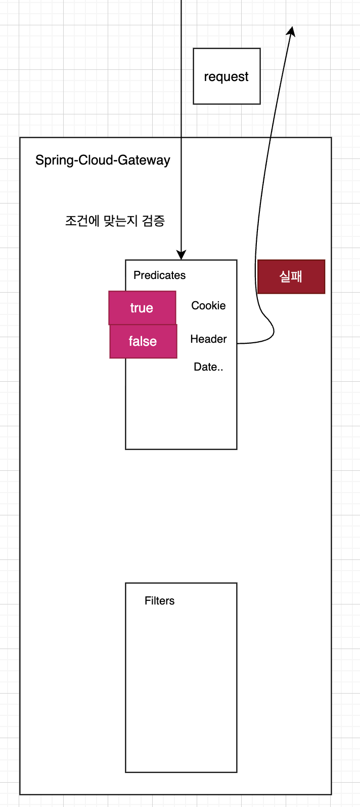
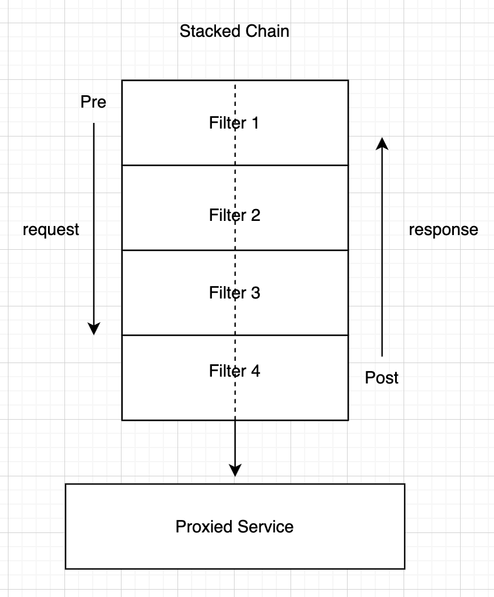

### API Gateway가 하는일은?

- API Gateway는 단순히 요청을 전달하는 우체국과 같은 역할을 수행하고 있다.
- Gateway는 문지기처럼 들어오는 모든 요청을 검사하고, 적절한 목적지로 안내하며, 필요한 경우 요청의 형태를 가공한다.
- Spring Cloud Gateway는 이런 역할을 수행하기 위해서 Route(경로), Predicate(조건), Filter(필터)라는 세 가지 핵심 요소를 동작시킨다.

### Route

- Gateway 관점에서 Route는 하나의 작업단위이다.

- 특정 요청이 어디로 가야 하는지(URI)
- 어떤 조건을 만족해야 하는지(Predicates)
- 과정에서 어떤 처리(Filters)가 필요한지

- Route는 고유한 ID를 통해 식별된다.

- 사용자가 정의한 수많은 Route 중 현재의 요청에 딱 맞는 하나를 찾아내는 것이 Gateway의 첫번째 임무이다.

### Predicate

요청이 Gateway에 도착하면 가장 먼저 검사한다.

Java 8의 Predicate 함수형 인터페이스를 기반으로 한다.

HTTP 요청의 모든 요소(헤더, 파라미터, 경로, 메서드 등)를 검사할 수 있다.

- 예시:
  - 요청 경로가 /api/user 로 시작하는가?
  - 헤더에 특정 인증 토큰이 포함되어 있는가?
  - 요청이 오후 2시 이후에 들어왔는가?

위와 같은 질문들을 던지며 검사한다.

- Gateway는 설정된 모든 Predicate가 True를 반환할 때만 해당 Route가 유효하다고 판단한다.

- 조건이 하나라도 맞지 않으면 가차 없이 다음 Route를 찾아 떠나거나 요청을 거절한다.

### Filter

- Predicate를 거치고 나서, Filter 영역에 들어온다.

- Filter는 Predicate를 통과한 요청을 실제 서비스로 보내기 전/후에 정교하게 가공하는 작업실이다.

- Filter는 요청이 실제 서비스(DownStream)로 전달되기 전(Pre-Filter)과 결과가 다시 클라이언트에게 돌아가기 전(Post-Filter)의 두 시점에서 동작한다.

- 마치 고속도로 톨게이트에서 영수증을 주고받거나 차량을 검사하는 것과 유사하다.

- 체인처럼 요청이 위에서 아래로(Pre), 응답이 아래에서 위로(Post) 흐르는 수직 구조이다.
- Pre-Filter : 요청 헤더에 사용자 정보를 추가하거나, 불필요한 파라미터를 제거하는 등의 가공 작업을 수행한다.
- Post-Filter : 서비스의 응답에 보안 헤더를 추가하거나, 응답 시간을 측정하여 메트릭을 남기는 등의 작업을 처리한다.

Filter들은 체인(Chain) 형태로 연결되어 있어, 순차적으로 하나씩 실행되며 요청과 응답을 점점 완성된 형태로 가공해 나간다.

### 요청의 여정

결국 클라이언트의 요청은 다음과 같은 순서로 Gateway를 통과하게 된다.

1. Handler Mapping : 들어온 요청이 어떤 Route의 Predicate 조건을 만족하는지 확인한다.
2. Web Handler : 매칭된 Route에 정의된 Filter 체인을 가동한다.
3. Pre-Filters : 실제 서비스로 가기 전 요청을 마음껏 가공한다.
4. Proxied Request : 가공된 요청이 드디어 목적지 서비스로 전달된다.
5. Post-Filters : 서비스로부터 돌아온 응답을 클라이언트에게 주기 전 마지막으로 다듬는다.

### ? 궁금한점 : Post-Filters가 처리 완료되기 전에 요청이 서비스에 전달되고 나서 기다리는 시간동안은 Gateway가 계속해서 스레드풀을 할당해두고 기다리고 있을까? Gateway에서는 어떻게 스레드풀들이 동작할까? 아 비동기 기반의 Gateway니까 이런게 다 비동기로 동작하는 건가?
